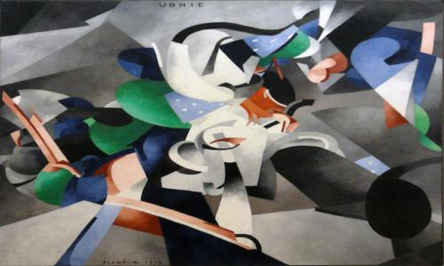
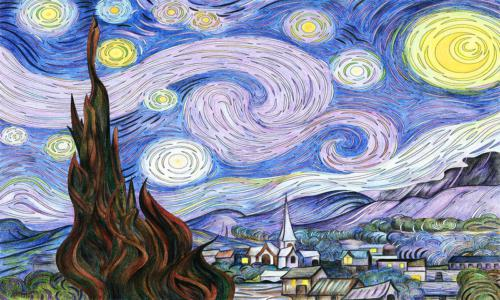

# Neural style transfer
PyTorch implementation of Neural Style Transfer

## What is Neural Style Transfer?
It is an algorithm that uses two images (one for the content and the other for the style). It transfers the style from the style image onto the content image using a pre-trained Convolutional Neural Network (commonly used CNN for this task: VGG-16 or VGG-19). The amount of style transferred can be controlled. 

## Purpose
The whole purpose of implementing Neural Style Transfer algorithm is to practice whatever I have learned. There are many good repos for Neural Style Transfer, the one I referred to while implementing NST in pytorch can be found under references below.

## Short theory
The most important part of Neural Style Transfer is the loss function. The loss value is computed as shown below. 

Loss value = alpha * content loss + beta * style loss + total variation weight * total variation loss

where, 
	alpha (content weight) - Controls the amount of content in the result 
	beta (style weight) - Controls the amount of style applied to the result 
	total variation weight - Controls how smooth the result should look  

<h4>Content loss</h4>
For two images to have the same content, the activations of both the images should be the same when passed through a pre-trained CNN. For our task, we try to match the activations of the content image and the output image at conv4_2 layer of VGG-19. This is because higher layers tend to capture objects present in the input image rather than the precise location of the object and the pixel value of the input image.
<h4>Style loss</h4>
For two images to have similar style, the combination of filters activated at most of the layers when passing both images through pre-trained CNN should match. For the style loss, we need to compute the gram matrix at selected layers using activation values of the filters when an image is passed through the CNN. Gram matrix at a particular layer contains filter correlation information at that layer. We try to match the gram matrix computed of the style and the output image at selected layers to transfer the style onto the output image.
<h4>Total variation loss</h4>
Sometimes using just the content and style loss can lead to noisy images, that is, the neighboring pixel values are very different compared to the current pixel. Total variation loss helps us to reduce noise in the output image by encouraging the neighbors to have similar values.
   
Once, the loss is computed, backpropagate using the created computation graph (which PyTorch does it for you) to compute influence of every single pixel in the output image on the final loss value. Use this information, update pixel values to minimize the loss.
  
For more details, explore references.

## Results
Content image displayed on the left, style image on the right and result of the style transfer displayed at the bottom of content and style image. 

## Important points

* All of the results are obtained using pre-trained VGG-19 and Adam optimizer.
* Convolutional layers were used for this implementation, specifically, conv4_2 for the content loss, whereas, conv1_1, conv2_1, conv3_1, conv4_1 and conv5_1 for the style loss. All the conv layers for the style loss were given same importance.
* Replaced all of the max pooling layers with average pooling as recommended in the paper.
* While using the google notebook (link provided in the next section), you will need to adjust the weights based on the output image, that is, if the image looks more like the style image, try decreasing the style weight. If the image is not smooth, try increasing total variation weight.

## Link to google notebook: 
[Neural style transfer notebook](https://colab.research.google.com/drive/1FhLGaMVZ8Kpq8sTXj5WsR-SOYfmfubvn?usp=sharing)

Feel free to change any of the settings.

## References
* [pytorch-neural-style-transfer](https://github.com/gordicaleksa/pytorch-neural-style-transfer)
* [d2l.ai - Neural Style Transfe](https://d2l.ai/chapter_computer-vision/neural-style.html)
* [NST paper](https://www.cv-foundation.org/openaccess/content_cvpr_2016/papers/Gatys_Image_Style_Transfer_CVPR_2016_paper.pdf)